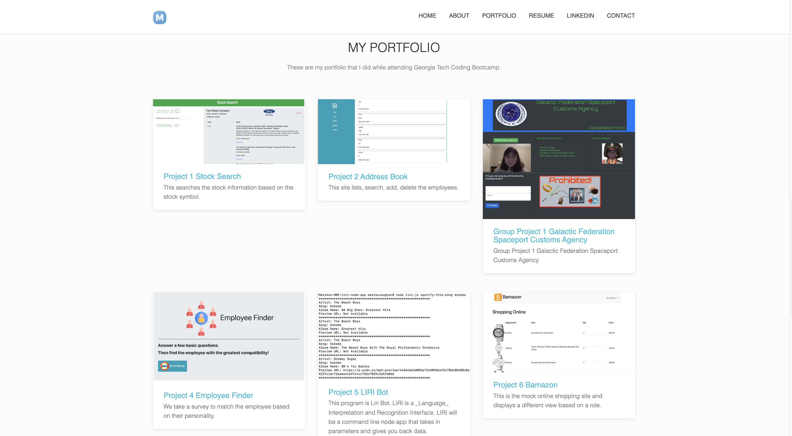
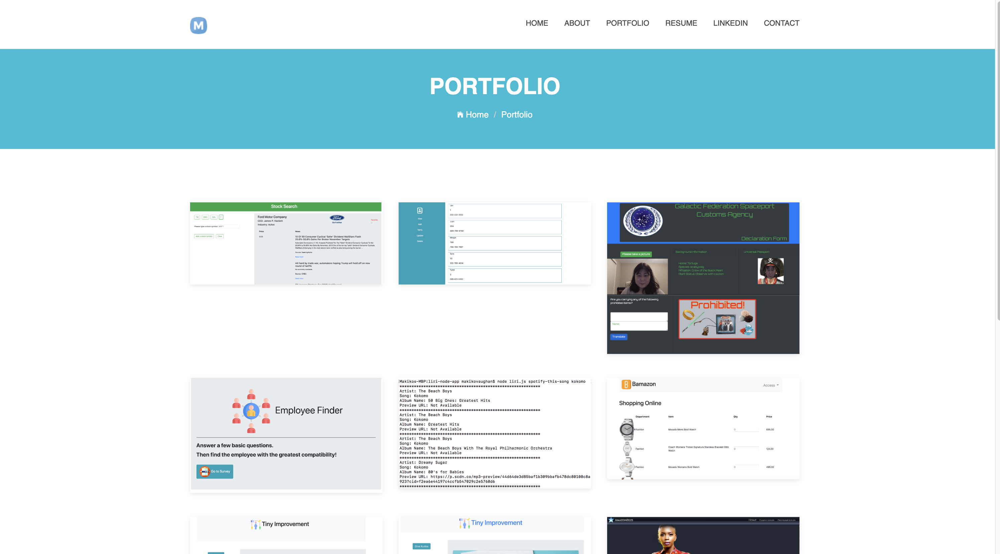

# Bootstrap-Portfolio

## Description
This is my web site using Bootstrap.

## Structure of files 

* index.html: This page is for about me.
* portfolio.html: This page contains the list of projects I have done.
* contact.html: The contact site(Under the construction Frame only).
* ./assets/css/style.css: CSS file
* ./assets/css/images: Images files for this web site.

## Page Information

* index.html

* gallery.html

* contact.html

# Author
Makiko Vaughan(makiko.vaughan@gmail.com)